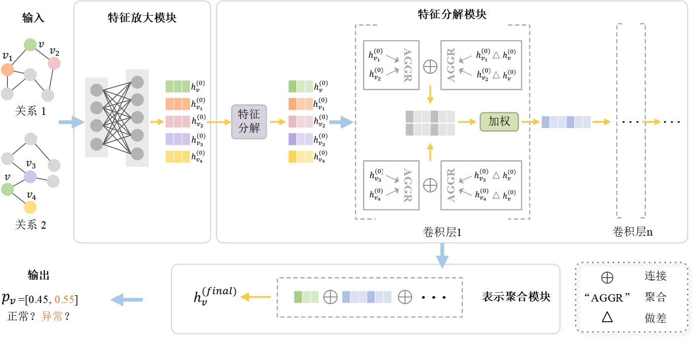

# Overview


<h2 align="center">
<figure> </figure>
</h2>

# Dataset
YelpChi and Amazon can be downloaded from [here](https://github.com/YingtongDou/CARE-GNN/tree/master/data) or [dgl.data.FraudDataset](https://docs.dgl.ai/api/python/dgl.data.html#fraud-dataset).

Run `python src/data_process.py` to pre-process the data.

# Dependencies
Please set up the environment following Requirements in requirements.txt.
```sh
argparse          1.1.0
networkx          3.1
numpy             1.26.2
scikit_learn      1.3.2
scipy             1.11.4
torch             2.1.2
```

# Reproduce
```sh
python main.py --config ./config/yelpchi.yml --multi_run
```

# Acknowledgement
Our code references:
- [CAREGNN](https://github.com/YingtongDou/CARE-GNN)

- [PCGNN](https://github.com/PonderLY/PC-GNN)